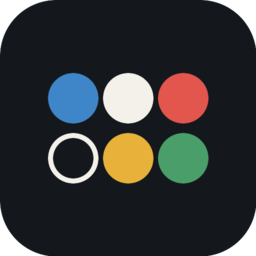
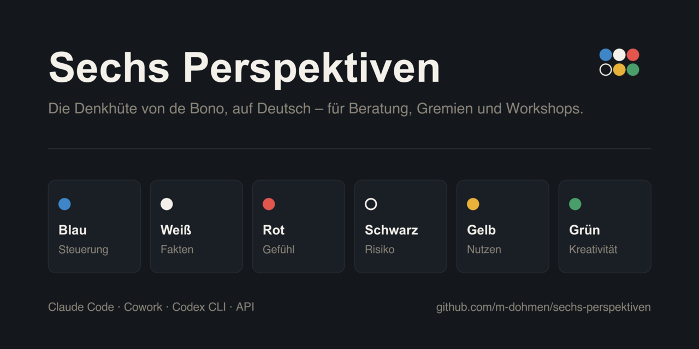

<br />

# Sechs Perspektiven

Ein Skill, der eine Frage in sechs getrennten Durchgängen durchdenkt, statt Fakten, Bauchgefühl, Risiko und Zuversicht in einer Antwort zu vermischen.



Die Denkhüte von Edward de Bono sind seit 1985 Werkzeug jeder Moderation. Das englischsprachige Vorbild dieses Skills, [six-thinking-hats](https://github.com/ysskrishna/ai-agent-skills/tree/main/skills/six-thinking-hats) von ysskrishna, bringt die Methode sauber in ein Skill-Format. Was darin fehlt, ist alles, woran ein Vorhaben in Deutschland, Österreich oder der Schweiz tatsächlich scheitert: Mitbestimmung, Datenschutz, Aufsicht, Vergaberecht, Sitzungstermine. Diese Fassung ist deshalb für den DACH-Raum neu geschrieben.

## Schnellstart

In jedem Agenten mit Kommandozeile – Claude Code, Codex, Cursor, Windsurf, Gemini, opencode, Zed und viele weitere – genügt ein Befehl:

```bash
npx skills add m-dohmen/sechs-perspektiven
```

Das legt den Skill im aktuellen Projekt ab. `-g` installiert ihn global für alle Projekte, `npx skills update` holt spätere Fassungen nach.

Claude Cowork, claude.ai und Claude Projects kennen die CLI nicht. Dort führt der Weg über ein ZIP, das aus dem Repository gebaut wird:

```bash
git clone https://github.com/m-dohmen/sechs-perspektiven.git
cd sechs-perspektiven
./scripts/build.sh
```

Das legt `dist/sechs-perspektiven.zip` an – ein Ordner `sechs-perspektiven/` mit `SKILL.md` und drei Dateien unter `references/`.

| Umgebung | Installation | Aufruf |
| --- | --- | --- |
| Claude Code | `npx skills add m-dohmen/sechs-perspektiven` | `/sechs-perspektiven <Leitfrage>` |
| Claude Code (als Plugin) | `/plugin marketplace add m-dohmen/sechs-perspektiven` | `/sechs-perspektiven <Leitfrage>` |
| Codex CLI | `npx skills add m-dohmen/sechs-perspektiven` | `$sechs-perspektiven <Leitfrage>` |
| Cursor, Windsurf, Gemini, Zed u. a. | `npx skills add m-dohmen/sechs-perspektiven` | „Denk das in sechs Perspektiven durch.“ |
| Claude Cowork / claude.ai | ZIP unter *Customize > Skills* hochladen, danach einschalten | „Denk das in sechs Perspektiven durch.“ |
| Claude Projects | `SKILL.md` ins Projektwissen | „Denk das in sechs Perspektiven durch.“ |
| API / eigene Anwendung | `SKILL.md` in den System-Prompt | – |

## Installation per CLI

Die [skills-CLI](https://skills.sh) erkennt den laufenden Agenten selbst und installiert an die passende Stelle – `.claude/skills/` bei Claude Code, `.agents/skills/` bei Codex und so weiter.

```bash
# ins aktuelle Projekt
npx skills add m-dohmen/sechs-perspektiven

# global für alle Projekte
npx skills add -g m-dohmen/sechs-perspektiven

# ohne Rückfragen, etwa in einem Setup-Skript
npx skills add m-dohmen/sechs-perspektiven -g -y
```

`npx skills list` zeigt, was installiert ist, `npx skills update` holt neue Fassungen, `npx skills remove sechs-perspektiven` entfernt den Skill wieder.

## Claude Code als Plugin

Wer den Skill über die Plugin-Verwaltung statt über die CLI einbinden will – etwa um ihn im Team über ein internes Marketplace-Verzeichnis zu verteilen:

```
/plugin marketplace add m-dohmen/sechs-perspektiven
/plugin install sechs-perspektiven@sechs-perspektiven
```

Beide Wege führen zum selben Skill. Die CLI ist kürzer, das Plugin lässt sich über `/plugin` zentral aktualisieren und abschalten.

## Claude Cowork

Cowork und claude.ai teilen dieselbe Skill-Verwaltung. Einmal hochgeladen, gilt der Skill in beiden.

1. **Customize** in der linken Seitenleiste öffnen, Reiter **Skills**.
2. Auf **+** klicken, dann **Create skill** und **Upload skill** wählen.
3. `dist/sechs-perspektiven.zip` hochladen.
4. Den Schalter neben dem Skill einschalten – neu hochgeladene Skills sind zunächst aus.

Danach greift der Skill von selbst, sobald eine Anfrage passt:

- „Sechs Perspektiven zu der Frage, ob wir die Rechnungsverarbeitung umstellen.“
- „Mach mir daraus eine Entscheidungsvorlage nach den Denkhüten, Adressat ist die Geschäftsführung.“
- „Modus Risiko, Tiefe tief: Auslagerung des Rechenzentrumsbetriebs nach Irland.“

Enthält das ZIP die Dateien flach statt im Ordner `sechs-perspektiven/`, lehnt Claude den Upload ab. `build.sh` packt den Ordner richtig mit. In Team- und Enterprise-Organisationen muss ein Owner eigene Skills zusätzlich erlauben.

## Codex CLI

`npx skills add m-dohmen/sechs-perspektiven` erledigt das Folgende automatisch. Von Hand geht es so: Codex liest Skills aus `.agents/skills`. Global für alle Repositories:

```bash
mkdir -p ~/.agents/skills && unzip -o dist/sechs-perspektiven.zip -d ~/.agents/skills/
```

Nur für ein Projekt – dann im Repository-Wurzelverzeichnis:

```bash
mkdir -p .agents/skills && unzip -o dist/sechs-perspektiven.zip -d .agents/skills/
```

Aufruf in einer Codex-Sitzung:

```
$sechs-perspektiven Sollen wir den Support auf ein Ticketsystem umstellen?
```

`/skills` listet die gefundenen Skills – damit prüfst du, ob die Installation gegriffen hat.

## Claude Projects und API

**Claude Projects** – die Dateien aus `skills/sechs-perspektiven/` in das Projektwissen hochladen: `SKILL.md` und die drei Dateien unter `references/`.

**API oder eigene Anwendung** – den Inhalt von `skills/sechs-perspektiven/SKILL.md` in den System-Prompt übernehmen. Die Referenzdateien nur bei Bedarf nachladen.

## Die sechs Perspektiven

| | Rolle | Was dort passiert | Pflichtform |
| --- | --- | --- | --- |
| 🔵 | **Blau** | Steuerung: rahmt zu Beginn, führt am Ende zusammen | keine neuen Inhalte in der Synthese |
| ⚪ | **Weiß** | Fakten, Belege, Lücken | jeder Punkt `[BELEGT]`, `[ANNAHME]` oder `[OFFEN]` |
| 🔴 | **Rot** | Bauchgefühl, Widerstand, Intuition | geäußert wörtlich, vermutet im Konjunktiv |
| ⚫ | **Schwarz** | Fehlerquellen und Schwachstellen | **Risiko** – **Gegenmaßnahme** |
| 🟡 | **Gelb** | Nutzen und Gelegenheiten | **Nutzen** – **Bedingung** |
| 🟢 | **Grün** | Alternativen und andere Zuschnitte | eine Option je Punkt, keine Bewertung |

Die Pflichtformen sind der eigentliche Nutzen der Methode im Agentenbetrieb. Ein Risiko ohne Gegenmaßnahme ist eine Klage, ein Nutzen ohne Bedingung ein Werbesatz, und eine Zahl ohne Quelle ist keine Tatsache. Der Skill lässt keines davon durch.

## Modi und Tiefe

| Modus | Reihenfolge | Wofür |
| --- | --- | --- |
| **Vollbild** (Standard) | Blau → Weiß → Rot → Schwarz → Gelb → Grün → Blau | Breite Entscheidungen |
| **Kreativ** | Blau → Grün → Gelb → Rot → Blau | Ideenfindung, ohne frühe Kritik |
| **Risiko** | Blau → Weiß → Schwarz → Blau | Risikodurchsicht, Prüfvorbereitung |
| **Entscheidung** | Blau → Weiß → Schwarz → Gelb → Blau | Go/No-Go |
| **Vorlage** | wie Entscheidung, plus Beschlussvorlage | Gremiensitzung |
| **Workshop** | frei, Blau am Schluss | moderierte Runde, eine Perspektive pro Nachricht |
| **Frei** | selbst gewählt + Blau | eigene Zusammenstellung |

Tiefe: **Kurz** (2 Punkte je Perspektive), **Standard** (3), **Tief** (4–5, dazu Risiken mit Eintritt und Wirkung).

## Was für den DACH-Raum dazugekommen ist

**DACH-Prüfpunkte.** Der Skill geht sie je Perspektive still durch und nimmt auf, was für die Leitfrage zählt: Mitbestimmung (§ 87 Abs. 1 Nr. 6 BetrVG, § 96 ArbVG, Mitwirkungsgesetz), DSGVO und revDSG, EU AI Act, NIS2, DORA, MaRisk, Vergaberecht, Aufsicht durch BaFin, FMA und FINMA, Lieferkettensorgfalt. Ausführlich in [`references/dach-pruefpunkte.md`](skills/sechs-perspektiven/references/dach-pruefpunkte.md).

**Beschlussvorlage.** Der Modus *Vorlage* hängt an die Synthese einen Block an, der ohne Umbau in eine Sitzungsunterlage geht: Sachverhalt, Entscheidungsbedarf, Optionen, Empfehlung, Mittel und Termine, offene Punkte.

**Adressat als Pflichtangabe.** Vorstand, Lenkungsausschuss oder Fachbereich steuern Tonlage und Detailgrad. Ohne diese Angabe schreibt jeder Agent für niemanden.

**Deutsch, das in einem Haus durchgeht.** Siezen als Standard, deutsche Typografie, kein Beraterdenglisch, kein Nominalstil. Ein Text mit „Low Hanging Fruits“ überlebt keine Vorstandsvorlage.

**Moderationsleitfaden.** Zeitraster für 90 Minuten, Umgang mit Rangdynamik, typische Störungen – in [`references/moderation.md`](skills/sechs-perspektiven/references/moderation.md).

## Was er nicht tut

**Er erfindet nichts.** Fehlt eine Zahl, steht sie als `[OFFEN]` in Weiß und taucht am Ende in der Vorlage wieder auf. Eine Wirtschaftlichkeitsrechnung aus geschätzten Werten wäre schlimmer als keine.

**Er gibt keinen Rechtsrat.** Die DACH-Prüfpunkte sind eine Gedächtnisstütze. Sie machen sichtbar, wo Justiziariat oder Kanzlei gebraucht werden – sie ersetzen beide nicht.

**Er entscheidet nicht vorab.** Die Empfehlung in der Synthese darf nur aus dem stammen, was die Perspektiven ergeben haben. Fällt sie dünn aus, war die Runde dünn, und das ist ein Befund.

**Er bewertet keine Personen.** Bei Personalthemen bleibt Rot bei den Wirkungen auf Beteiligte.

## Anpassen

Zwei Stellen lohnen sich, bevor der Skill im eigenen Haus verteilt wird:

1. **Die DACH-Prüfpunkte** in `skills/sechs-perspektiven/references/dach-pruefpunkte.md` um das eigene Regelwerk ergänzen – Konzernrichtlinien, Freigabegrenzen, Gremientermine, Branchenaufsicht.
2. **Den Modus *Vorlage*** an die hauseigene Sitzungsunterlage angleichen. Die Gliederung im Abschnitt *Beschlussvorlage* von `SKILL.md` ist ein Vorschlag, kein Standard.

Nach jeder Änderung `./scripts/build.sh` erneut laufen lassen und das ZIP neu hochladen oder entpacken.

## Aufbau

```
sechs-perspektiven/
├── skills/
│   └── sechs-perspektiven/          # das, was installiert wird
│       ├── SKILL.md                 # Perspektiven, Modi, Regeln, Checkliste
│       └── references/
│           ├── beispielsitzung.md   # durchgespielte Runde im Modus Vorlage
│           ├── dach-pruefpunkte.md  # Recht, Aufsicht, Gremien für DE/AT/CH
│           └── moderation.md        # Ablauf für Runden mit mehreren Personen
├── .claude-plugin/
│   ├── plugin.json                  # Plugin-Manifest für Claude Code
│   └── marketplace.json             # Marketplace-Eintrag
├── assets/
│   ├── icon.svg                     # Quelle für das Icon
│   ├── icon-512.png                 # Icon, 512 px
│   ├── icon-256.png                 # Icon, 256 px (im README oben rechts)
│   └── social.png                   # Social Preview, 1280 × 640
└── scripts/
    ├── build.sh                     # baut dist/sechs-perspektiven.zip (und .skill)
    ├── build-assets.sh              # rendert die PNGs in assets/
    └── social.py                    # Zeichenanweisungen für social.png
```

Alles unterhalb von `skills/sechs-perspektiven/` landet beim Installieren im Agenten, alles daneben ist Projektbeiwerk und bleibt hier. Deshalb liegt der Skill in einem Unterordner und nicht im Wurzelverzeichnis: `npx skills add` kopiert sonst README, Changelog und Bilddateien mit in das Skill-Verzeichnis.

`dist/` ist nicht eingecheckt. `sechs-perspektiven.skill` ist eine identische Kopie des ZIP unter anderem Namen und liegt als Release-Artefakt bei; für den Upload in Cowork oder claude.ai die `.zip`-Variante nehmen.

Das Social Image trägt GitHub nicht automatisch ein: unter *Settings > General > Social preview* einmal `assets/social.png` hochladen. `build-assets.sh` baut Icon und Social Image neu und braucht dafür ImageMagick und Python 3, keinen Browser.

## Herkunft und Dank

Diese Fassung baut auf dem Skill [six-thinking-hats](https://github.com/ysskrishna/ai-agent-skills/tree/main/skills/six-thinking-hats) von **[ysskrishna](https://github.com/ysskrishna)** auf, veröffentlicht unter MIT. Von dort stammen der Aufbau mit einer Perspektive pro Abschnitt, die Modi, die Tiefenstufen, die Pflichtformate in Weiß, Schwarz und Gelb und die Regel, dass die Synthese nichts Neues einführen darf. Danke an ysskrishna für die Vorarbeit und dafür, sie offen geteilt zu haben.

Die Methode selbst geht auf **Edward de Bono**, *Six Thinking Hats* (1985), zurück. Dieses Repository setzt sie um und beansprucht keine Rechte an ihr.

Was übernommen wurde und was neu ist, steht im Einzelnen in [CREDITS.md](CREDITS.md). Der Urheberhinweis des Originals liegt in [NOTICE](NOTICE).

## Mitmachen

Fehlende Prüfpunkte, schwache Runden oder Vorschläge für die Beschlussvorlage: siehe [CONTRIBUTING.md](CONTRIBUTING.md). Für dieses Projekt gilt ein [Verhaltenskodex](CODE_OF_CONDUCT.md). Sicherheitsrelevante Funde bitte gemäß [SECURITY.md](SECURITY.md) melden.

## Lizenz

MIT
